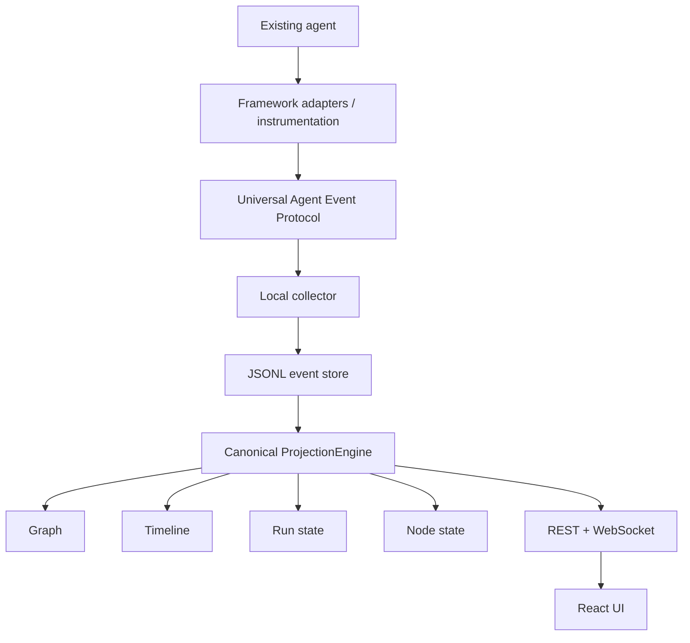

# Tselora

**The execution shadow for intelligent systems.**

Tselora is an open-source **execution intelligence platform for AI agents**. It plugs into an existing agent, observes what actually ran, and reconstructs the execution graph, timeline, node state, causal relationships, retries, loops, parallel branches, and observable decision metadata.

Developers can inspect what happened, understand why execution changed (from structured metadata, not private reasoning), and eventually replay, control, and learn from previous executions.

Tselora is **not** another agent framework or orchestration runtime. It is a developer / execution-intelligence layer that works **with** agents you already have.

> Status: **local execution-shadow foundation**. Protocol, JSONL collector, raw-Python SDK, ProjectionEngine, REST snapshots, live `StatePatch` WebSocket, and a one-run React viewer exist. Node inspector, Why? display, and visualization replay are still v1 scope, not this slice. See [docs/product/v1.md](docs/product/v1.md) and [docs/development/development-guide.md](docs/development/development-guide.md).

## What problem it solves

Agent runs are hard to inspect. Logs are linear. Framework traces mix transport, prompts, and orchestration. When a critic fails, a plan changes, or a node retries, it is often unclear:

- which **logical node** ran, and which **invocation** it was
- what **caused** the next step (`parent_event_id`, not “the next log line”)
- how **fan-out, loops, and retries** relate in the graph
- whether a “why” is **observable metadata** or reconstructed guesswork

Tselora treats execution as an **append-only event log** plus a **canonical projection** of that log into graph, timeline, and state.

## What Tselora is not

- Not an agent framework, planner, or orchestrator
- Not a replacement for LangGraph, CrewAI, OpenAI Agents SDK, Google ADK, etc.
- Not a chain-of-thought recorder
- Not a generic “re-run any Python agent” debugger in v1
- Not an inference engine, vLLM replacement, generic LLM dashboard, or evaluation product
- Not a cloud control plane, multi-tenant SaaS, or production auth system in v1

## Planned capabilities

These are **product directions**. Only a subset is in [v1 scope](docs/product/v1.md).

| Capability | Intent | Horizon |
| --- | --- | --- |
| Execution graph | Logical nodes + execution instances; edges from causality | v1 |
| Timeline | Ordered view by per-run `sequence` | v1 |
| Node inspection | Status, payload, metadata per instance | v1 |
| Observable “Why?” | Structured decision metadata emitted by the agent | v1 (display) |
| Replay / time travel | Re-project the event log; visualization only | v1 |
| Runtime control | Pause, resume, stop, approve, retry, fork | **Future** |
| Cross-run experience | Compare runs, historical evidence | **Future / experimental** |
| Framework adapters | Translate framework activity into the event protocol | Staged after core |

## Canonical v1 data flow



The **event log is the source of truth**. The UI does not invent execution semantics. WebSocket carries **state patches** after projection, not a second copy of the log as the authority.

## Persistence (v1)

**No database in v1.** Append-only JSONL files:

```text
.agent-devtools/
  runs/
    run_<id>/
      events.jsonl
      metadata.json
      snapshot.json   # optional optimization later; never source of truth
```

`EventStore` is an abstraction so JSONL can later be replaced by SQLite/Postgres **without** changing the event protocol or projection architecture. See [docs/architecture/persistence.md](docs/architecture/persistence.md) and [ADR-006](docs/adr/ADR-006-file-based-persistence.md).

## Repository layout

| Path | Role |
| --- | --- |
| `core/` | Event protocol, projection, context, redaction |
| `sdk/` | Emission, batching, transport, decorators |
| `server/` | Collector, storage, REST, WebSocket |
| `adapters/` | Framework-neutral translations into the protocol |
| `ui/` | One-run live React viewer (graph, nodes, timeline) |
| `cli/` | Local developer CLI |
| `docs/` | Architecture, ADRs, product, development |
| `examples/` | Sample agents for acceptance tests (later) |
| `tests/` | Invariant-focused tests |

## Documentation map

- Product: [vision](docs/product/vision.md) · [scope](docs/product/scope.md) · [v1](docs/product/v1.md) · [roadmap](docs/product/roadmap.md)
- Architecture: [overview](docs/architecture/overview.md)
- Development: [getting started](docs/development/getting-started.md) · [guide](docs/development/development-guide.md) · [testing](docs/development/testing-strategy.md)
- Contributing: [CONTRIBUTING.md](CONTRIBUTING.md)

## Stack (intended)

Python 3.12+, Pydantic, FastAPI, React, TypeScript, React Flow, WebSockets, Typer (CLI). v1 persistence is **JSONL**, not SQLite.

## License

[Apache License 2.0](LICENSE)
