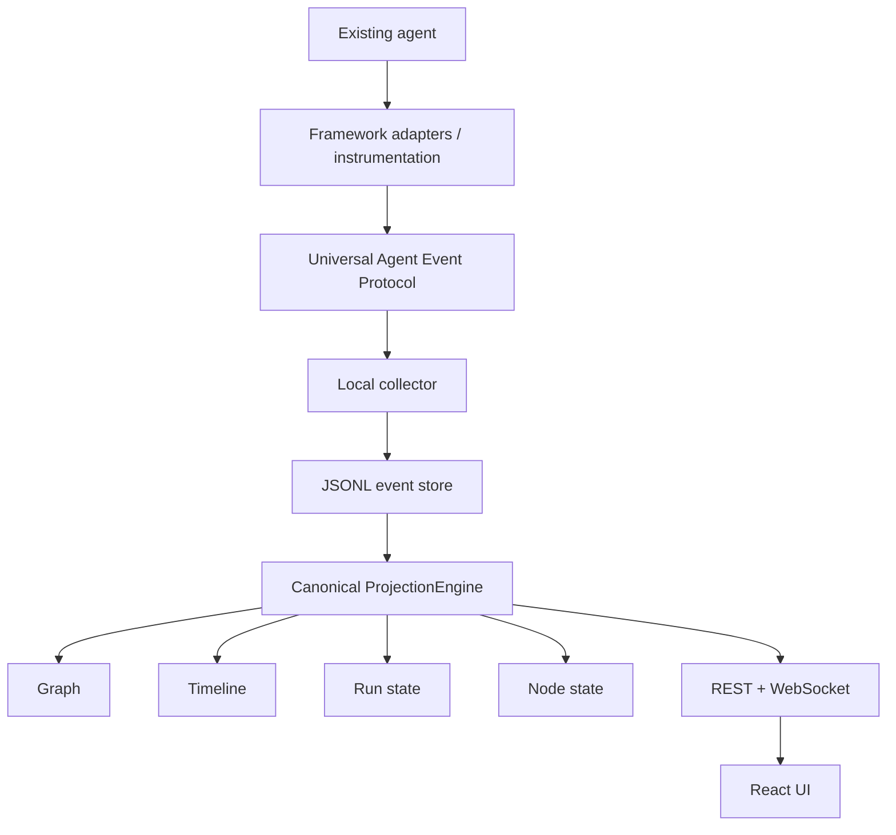

# Data flow

## Purpose

Define the **only** v1 path from an existing agent to the UI, and the direction of truth.

## Canonical v1 flow

This path is locked. Do not add databases, brokers, or a second semantic engine in the frontend.

## Responsibilities by hop

### Existing agent

Runs as the user wrote it. Tselora does not replace orchestration.

### Framework adapters / instrumentation

Observe framework or decorator boundaries. Emit protocol events. Attach `actor`, `node`, `execution_instance_id`, `parent_event_id` using the **contextvars** stack, not a process-global “current node”.

### Universal Agent Event Protocol

Stable contract. SDK assigns `event_id` and per-run `sequence` **at emit time**.

### Local collector

HTTP (or equivalent local) ingest. Redact. Deduplicate by `event_id`. Persist **immediately**. Notify live projection. Tolerate out-of-order arrival. Live buffering is not persistence.

### JSONL event store

Append-only files under `.agent-devtools/runs/run_<id>/`. Authoritative.

### ProjectionEngine

`apply(event)` and `rebuild(events)`. Derives graph, timeline, run state, node state. Produces patches for live UI **after** `apply`. Live contiguous wait / 2.0s skip-hole is [ADR-007](../adr/ADR-007-live-sequence-gap.md), not a change to this engine.

### REST + WebSocket

REST: initial load, full state, history, reconnect — **`rebuild` from JSONL only**; no live buffer, no 2.0s timer.  
WebSocket: live **state patches** after `apply` of an event or drained batch, not the full log, not buffered events ([ADR-007](../adr/ADR-007-live-sequence-gap.md)).

### React UI

Renders projections. Replay is re-projection (or cached projections keyed by sequence), not a separate graph algorithm.

## Inputs

- Event envelopes matching the protocol
- Optional metadata.json per run
- Control commands in the **future** (not v1 implementation)

## Outputs

- Durable events.jsonl
- Projected state documents
- REST JSON
- WebSocket patch frames

## Invariants

- Collector receive order ≠ causal truth.
- Transport is asynchronous; delivery is at-least-once.
- Patches are derived **after** projection (`apply` / drained batch).
- REST rebuild does not observe the live sequence buffer.
- No hop may introduce a competing source of truth.

## Failure cases

| Failure | Expected behavior |
| --- | --- |
| Adapter crash mid-node | Best-effort `*.failed` if the SDK can still emit; otherwise run looks incomplete until timeout/UI shows last known state |
| Duplicate delivery | Ignored after first persist/apply for that `event_id` |
| Late / out-of-order `sequence` | Persist immediately. Live buffers until contiguous or 2.0s skip-hole ([ADR-007](../adr/ADR-007-live-sequence-gap.md)). REST rebuilds the log as stored. |
| Late parent | Graph may briefly lack an edge; rebuild must be complete |
| UI refresh | REST loads from store + projection; must match replay of JSONL |

## Future extension points

- Snapshot files to skip full rebuild (must still verify against log)
- Bidirectional command path (UI → collector → SDK) recorded as events
- Remote collector (requires security model; not v1)
