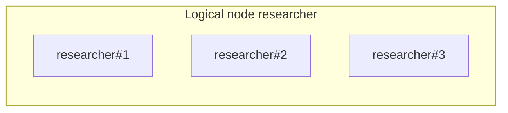

# Execution model

## Purpose

Describe how Tselora models **work**, not how any one framework schedules it.

## Logical nodes vs execution instances

**Logical `node_id`** (typically `node.id`): the conceptual unit—`researcher`, `critic`, `writer`.

**`execution_instance_id`**: one invocation—`researcher#1`, `researcher#2`.

Loops **reuse** the same logical id. Iterations are distinguished by `sequence` and `execution_instance_id`. Concurrent fan-out uses distinct instance ids under the same logical node.

The UI **may collapse** fan-out visually to one logical node while the projection **retains** every instance internally.

## Causality

**Edges are derived primarily from `parent_event_id`.**

Do **not** draw causal edges from:

- JSONL append order
- collector receive order
- timestamp adjacency
- “next event in the array”

Timestamps are for display and debugging, not graph topology.

## Actor vs node

`actor` is who performed the step (agent, tool runtime, human approver). `node` is the graph position. They often align but are not required to be identical.

## Concurrency

Active node identity lives on a **contextvars stack**, not a global current node. See [concurrency.md](concurrency.md).

## Status

Node and run status are **projections** of events (`*.started`, `*.completed`, `*.failed`, pause/resume, …). The UI must not invent status.

## Inputs

Protocol events with optional `node`, `execution_instance_id`, `parent_event_id`, `status`.

## Outputs

`GraphState` (logical nodes, instances, causal edges), `NodeState` per instance, `RunState`.

## Invariants

- Same `node.id` across loop iterations
- Distinct instance ids for distinct invocations
- No temporal-adjacency edges
- Fan-out collapse is a **view**, not a loss of instances in the engine

## Failure cases

- Missing `parent_event_id`: node may appear disconnected; do not guess a parent from time.
- Missing `execution_instance_id`: projection may synthesize a conservative instance key **only** if documented; prefer requiring it from the SDK for node-scoped events.
- Context lost: orphan events; still persist; graph shows a break.

## Future extension points

- Explicit `loop.detected` annotations for UI grouping
- Checkpoint/resume instance mapping (`run.forked`)
