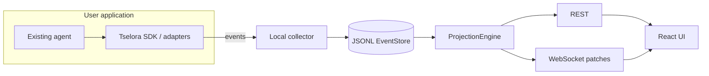

# Architecture overview

Tselora is a **local-first execution intelligence layer**. An existing agent emits structured events. A collector appends them to an immutable log. A single ProjectionEngine derives graph, timeline, and state. REST and WebSocket serve that projected state to a React UI.

Tselora does not run the agent’s planner, tools, or LLM calls. It observes them.

## Purpose

Give developers a faithful, inspectable **shadow** of what an agent actually executed: structure, time, state, causality, retries, loops, and parallel work—plus **observable** decision metadata.

## Responsibilities

| Component | Owns | Does not own |
| --- | --- | --- |
| Adapters / SDK instrumentation | Translating activity into protocol events; contextvars stack; IDs and sequence | Framework objects in core; private CoT |
| Universal Agent Event Protocol | The contract: required fields, types, causality | Storage engine, UI layout |
| Collector | Receive, redact, dedupe, persist | Interpreting graph semantics |
| EventStore (JSONL in v1) | Durable append-only log | Query language, multi-node replication |
| ProjectionEngine | Run/node/graph/timeline state; patches | Persistence format |
| REST | Bootstrap, full state, history, reconnect | Live incrementals as source of truth |
| WebSocket | State patches after projection | Rebuilding semantics in the client |
| React UI | Rendering projected state; replay slider over projections | Independent execution graph logic |
| Command channel (future) | Forwarding control intents | Being the source of runtime state |

## Inputs and outputs

**Inputs:** protocol events from SDK/adapters (at-least-once, possibly duplicate, possibly out of order).

**Outputs:** JSONL log; projected `RunState`, `NodeState`, `GraphState`, `TimelineState`; REST snapshots; WebSocket `StatePatch` messages; UI views.

## Invariants

1. The event log is authoritative.
2. ProjectionEngine is the only semantic interpreter of execution.
3. `sequence` orders events within a run; network order does not.
4. `parent_event_id` is the primary causal edge.
5. Logical `node.id` ≠ `execution_instance_id`.
6. Duplicate `event_id` must not duplicate state.
7. Rebuild from the log equals incremental apply.
8. UI can always be reconstructed from the log (REST bootstrap).
9. Core models stay framework-neutral.
10. No private chain-of-thought capture.

## Failure cases

- Collector down: SDK batches and retries; duplicates possible; collector must be idempotent.
- Out-of-order events: buffer or apply with incomplete parent, then repair when parent arrives—implementation must still converge to the same rebuilt state.
- Lost context across threads/async/subprocesses: causal chain may break; document and provide propagation helpers.
- Corrupt JSONL line: isolate the run; do not silently skip in a way that looks like a successful projection.
- Client disconnect: REST reload + optional last-applied sequence; do not invent missing events in the UI.

## Future extension points

- `EventStore` implementations (SQLite, Postgres) behind the same interface
- Snapshots as **optimization only**
- Additional event types via versioned protocol
- Adapters for more frameworks
- Command/control channel (events still record outcomes)
- Cross-run indexes (not v1)

## System context

See also: [data-flow.md](data-flow.md), [event-protocol.md](event-protocol.md), [projection-model.md](projection-model.md).
