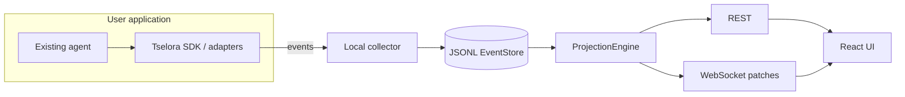

# Architecture overview

Tselora is an **execution intelligence layer for AI agents**. It captures and correlates agent execution events today, with an architecture designed to eventually correlate agent execution with inference-system telemetry and, later, enable execution-aware coordination and optimization.

It is **local-first**. An existing agent emits structured events. A collector appends them to an immutable log. A single ProjectionEngine derives graph, timeline, and state. REST and WebSocket serve that projected state to a React UI.

Tselora does not run the agent’s planner, tools, or LLM calls. It observes them. It is not an inference engine and not a present-day **Agent Control Plane**. Control, if it arrives, is a later evolution after observability and intelligence.

The current system is an **agent execution observability foundation**: Agent → nested Node/Function → Tool → LLM invocation, correlated by `run_id`, `event_id`, producer-side `sequence`, causal `parent_event_id`, stable `node.id`, `execution_instance_id`, lifecycle events, and reliable delivery (batching, retry, backpressure). That path remains the immediate implementation focus.

## Purpose

Give developers a faithful, inspectable **execution shadow**: structure, causality, logical `node.id`, execution instances, timeline, retries, loops, fan-out, and observable decisions. Tselora can coexist with OpenTelemetry and LLM observability/evaluation products via adapters; it is not those products.

## Responsibilities

| Component | Owns | Does not own |
| --- | --- | --- |
| Adapters / SDK instrumentation | Translating activity into protocol events; contextvars stack; IDs and sequence | Framework objects in core; private CoT |
| Universal Agent Event Protocol | The contract: required fields, types, causality | Storage engine, UI layout |
| Collector | Receive, redact, dedupe, persist | Interpreting graph semantics |
| EventStore (JSONL in v1) | Durable append-only log | Query language, multi-node replication |
| ProjectionEngine | Run/node/graph/timeline state; patches | Persistence format |
| REST | Bootstrap, full state, history, reconnect | Live incrementals as source of truth |
| WebSocket | State patches after projection | Rebuilding semantics in the client |
| React UI | Rendering projected state; replay slider over projections | Independent execution graph logic |
| Command channel (future) | Forwarding control intents | Being the source of runtime state |

## Inputs and outputs

**Inputs:** protocol events from SDK/adapters (at-least-once, possibly duplicate, possibly out of order).

**Outputs:** JSONL log; projected `RunState`, `NodeState`, `GraphState`, `TimelineState`; REST snapshots; WebSocket `StatePatch` messages; UI views.

## Invariants

1. The event log is authoritative.
2. ProjectionEngine is the only semantic interpreter of execution.
3. `sequence` orders events within a run; network order does not.
4. `parent_event_id` is the primary causal edge.
5. Logical `node.id` ≠ `execution_instance_id`.
6. Duplicate `event_id` must not duplicate state.
7. Rebuild from the log equals incremental apply.
8. UI can always be reconstructed from the log (REST bootstrap).
9. Core models stay framework-neutral and inference-system-neutral.
10. No private chain-of-thought capture.

## Failure cases

- Collector down: SDK batches and retries; duplicates possible; collector must be idempotent.
- Out-of-order events: buffer or apply with incomplete parent, then repair when parent arrives—implementation must still converge to the same rebuilt state.
- Lost context across threads/async/subprocesses: causal chain may break; document and provide propagation helpers.
- Corrupt JSONL line: isolate the run; do not silently skip in a way that looks like a successful projection.
- Client disconnect: REST reload + optional last-applied sequence; do not invent missing events in the UI.

## Future extension points

- `EventStore` implementations (SQLite, Postgres) behind the same interface
- Snapshots as **optimization only**
- Additional event types via versioned protocol (without redesigning execution semantics)
- Adapters for more frameworks
- Command/control channel (events still record outcomes)
- Cross-run indexes (not v1)
- Eventual correlation of agent execution with **inference-system telemetry** (not v1; see below)

Capability evolution (not the current roadmap): Execution Observability → Execution Intelligence → Execution Coordination → Execution Optimization / Control.

## Future Extension — Agent Execution and Inference Intelligence

Architectural direction only. This is **not** a Week 1–3 item, does not change locked ADRs, and does not authorize inference integrations in the current MVP.

Tselora may eventually correlate agent execution telemetry with inference-system telemetry (LLM requests, tokens, latency, queueing, cache behavior, GPU/runtime metrics). Inference servers such as vLLM remain **external**. Core stays inference-system-neutral. Tselora must not become an inference engine or assume a particular inference runtime.

An inference server answers how to execute model inference efficiently. Tselora’s future role is to understand how inference behavior relates to overall agent execution and, eventually, enable execution-aware coordination and optimization. Any later correlation should attach to existing identity (`run_id`, `event_id`, `parent_event_id`, `node.id`, `execution_instance_id`) rather than invent a parallel execution model. This document does not invent inference-specific event schemas now.

## System context

See also: [data-flow.md](data-flow.md), [event-protocol.md](event-protocol.md), [projection-model.md](projection-model.md).
