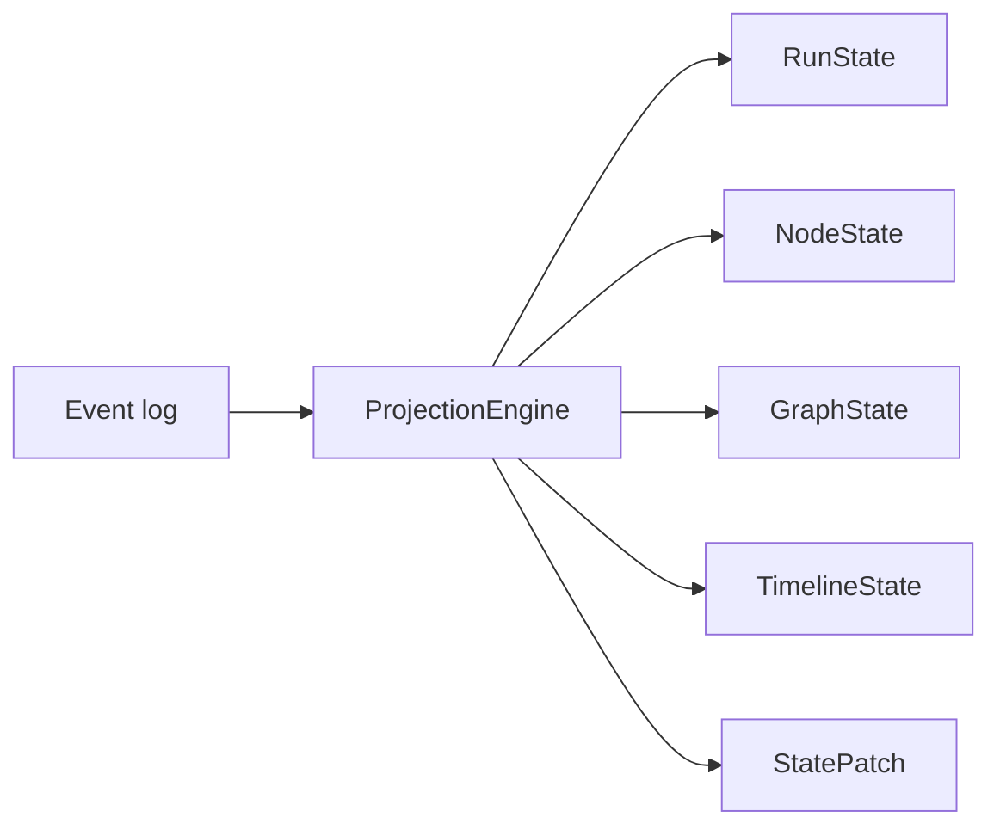

# Projection model

## Purpose

Turn the immutable event log into **canonical** run, node, graph, and timeline state. One engine; many consumers (live, REST, WebSocket, replay).

## Responsibilities

`ProjectionEngine`:

- `apply(event)` — incremental update, idempotent on `event_id`
- `rebuild(events)` — fold a sequence of events (ordered by `sequence`, not arrival) into state

Derived views:

- `RunState`
- `NodeState`
- `GraphState`
- `TimelineState`

Also: `StatePatch` generation for WebSocket (see [ADR-005](../adr/ADR-005-websocket-patches.md)). Live **when** to `apply` (contiguous buffer, skip-hole timeout) is [ADR-007](../adr/ADR-007-live-sequence-gap.md), outside this engine.

## What the engine is not

- Not a second graph in React
- Not a database query layer
- Not allowed to treat snapshots as truth

## Inputs

Validated protocol events. `rebuild` must sort by `(run_id, sequence)` and skip duplicates.

## Outputs

Deterministic state documents. Same events → same state (including after shuffle + rebuild).

## Invariants

- Determinism
- Incremental apply (in sequence order, skipping dupes) ≡ rebuild
- Duplicate `event_id` → no duplicate nodes/edges/timeline rows
- Causal edges from `parent_event_id`
- Snapshots, if added later, must be discardable

## Failure cases

- Apply with a hole in `sequence`: **REST `rebuild`** uses whatever was persisted, ordered by `sequence`. **Live** waits until contiguous or **2.0s skip-hole**, then `apply` in increasing `sequence` ([ADR-007](../adr/ADR-007-live-sequence-gap.md)). Do not apply in arrival order. After drain (including late fill of a skipped sequence), live snapshot ≡ JSONL rebuild. No gap event or watermark on projected state.
- Unknown event types: must not throw away the run; timeline should still list them.
- Conflicting status (two terminals): last **sequence** wins; record the conflict in metadata if needed.

## Replay and time travel

v1 replay = apply events up to sequence `N` and show that state. Same engine as live. Not process re-execution. See [replay.md](replay.md).

## Future extension points

- Snapshot + tail rebuild
- Indexed lookups for large runs
- Patch compaction

Do **not** fork semantics into the UI “for convenience.”
