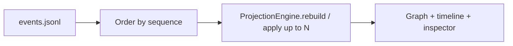

# Replay

## Purpose

v1 **replay** means **visualization / time-travel** over a recorded execution: re-run the **event log** through `ProjectionEngine` up to a chosen `sequence`.

## What v1 replay is

Same engine as live and REST. Deterministic. Refresh/reconnect uses the same log.

## What v1 replay is not

- Not generic **re-execution** of arbitrary Python agents
- Not process snapshot/restore
- Not “fork the agent at node X and continue in the real runtime” without an application **checkpoint/resume contract**

`checkpoint.created` exists in the protocol so applications can later mark restore points. Tselora will **not** serialize arbitrary interpreter state.

## Responsibilities

- ProjectionEngine: state at sequence N
- UI: scrubber / step through projected states
- Server: optional endpoint `GET /runs/{id}?through_sequence=N`

The UI must not implement a different replay interpreter.

## Inputs / outputs

**In:** persisted events.  
**Out:** projected state at N; identical to incremental apply of events with `sequence <= N`.

## Invariants

- Replay(N) ≡ apply all events with sequence ≤ N (after dedup)
- No extra semantics in the client
- Checkpoints are data, not a hidden VM

## Failure cases

- Missing early events: state is whatever the log contains; UI should indicate incompleteness
- Claiming “re-run” in docs or UI copy: forbidden for v1

## Future extension points

- True execution replay/fork **if** the app emits checkpoints and implements resume
- `run.forked` linking child `run_id`s
