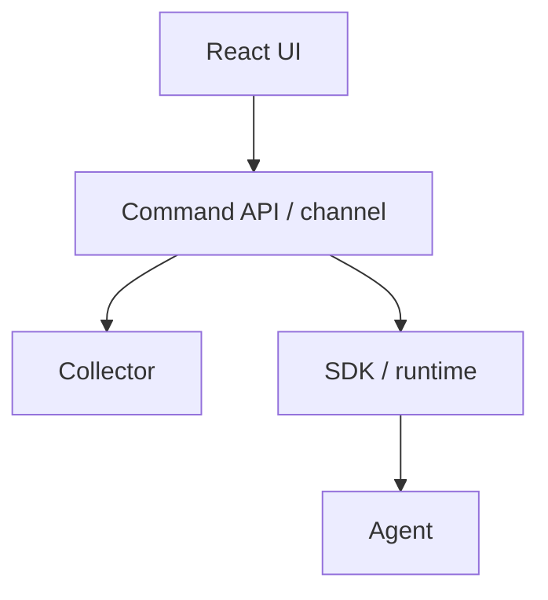

# Runtime control

## Purpose

Describe a **future** capability: pause, resume, stop, approve, retry, fork from the developer UI.

**Do not implement runtime control in v1.** This document locks the intended direction so UI and protocol stay aligned.

## Intended architecture

The UI is **never** the source of truth for runtime state. Every meaningful transition must eventually appear as an **event** (`run.paused`, `run.resumed`, `approval.*`, `retry.started`, `run.forked`, …).

## Responsibilities (future)

- UI: send intent (pause, approve, …)
- Collector: authenticate locally (later: remotely), forward, persist resulting events
- SDK: cooperate with the agent (cooperative pause points—not killing threads blindly)

## Inputs / outputs

**In:** commands.  
**Out:** protocol events reflecting what actually happened. If pause fails, the log must not show `run.paused`.

## Invariants

- Commands are not a parallel state machine in the UI
- ProjectionEngine remains canonical
- Approval is human-in-the-loop metadata + events, not hidden CoT

## Failure cases

- Agent ignores pause: UI shows last **event** state, not the button click
- Network split: at-least-once commands need idempotency keys (future)

## v1

Protocol already includes pause/resume/approval/retry/fork **event types**. Emission from a control plane is out of scope. Display those events if they appear in a log.
